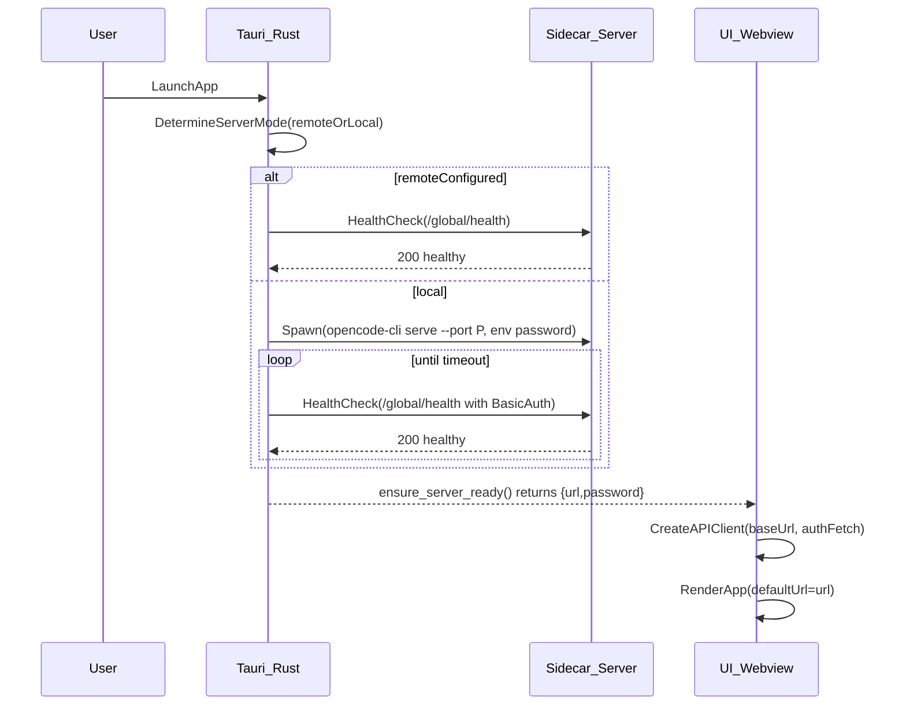
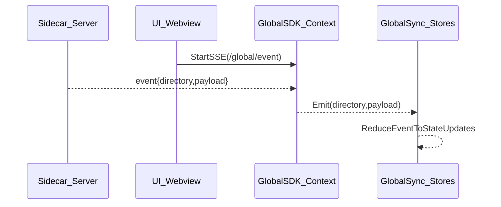
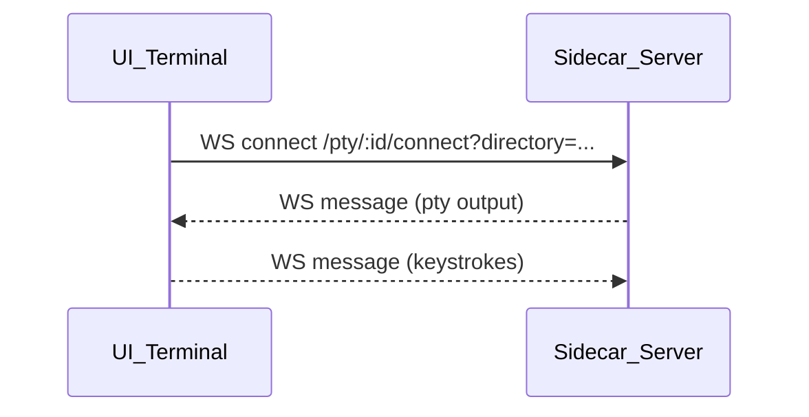

# Tauri Sidecar Server + Push Updates Architecture (Blueprint)

## Goals

- Ship a **single desktop app** that can:
  - **Start and manage** a local backend server process (sidecar) when needed.
  - Optionally **connect to a user-configured remote server** instead.
  - Provide the UI with a **single canonical base URL** for all API calls.
  - Receive **server-pushed updates** to keep UI state fresh without polling.
- Keep responsibilities cleanly separated:
  - **Tauri/Rust**: process management, readiness gating, OS integration.
  - **Server**: HTTP API + event streaming endpoints.
  - **UI**: state hydration + reacting to push events.

## High-level components (mirrors this repo)

- **Desktop wrapper (Tauri)**
  - Sidecar spawn, health polling, password generation, lifecycle cleanup.
  - Reference: [`packages/desktop/src-tauri/src/lib.rs`](/Users/wking/.reference/opencode/packages/desktop/src-tauri/src/lib.rs)
  - Sidecar binary bundling: [`packages/desktop/src-tauri/tauri.conf.json`](/Users/wking/.reference/opencode/packages/desktop/src-tauri/tauri.conf.json)

- **Backend server**
  - HTTP API, SSE streams for event push, WebSocket endpoints for interactive streams.
  - Reference: [`packages/opencode/src/server/server.ts`](/Users/wking/.reference/opencode/packages/opencode/src/server/server.ts)

- **Frontend app**
  - Reads “server ready” (URL + password) from Tauri.
  - Creates an API client with an auth-aware `fetch`.
  - Subscribes to SSE event stream(s), coalesces high-frequency updates, and updates UI stores.
  - Reference: [`packages/desktop/src/index.tsx`](/Users/wking/.reference/opencode/packages/desktop/src/index.tsx), [`packages/app/src/context/global-sdk.tsx`](/Users/wking/.reference/opencode/packages/app/src/context/global-sdk.tsx), [`packages/app/src/context/global-sync.tsx`](/Users/wking/.reference/opencode/packages/app/src/context/global-sync.tsx)

## Process model: what starts what

### Sidecar packaging

- Bundle the server binary as a **Tauri external sidecar**.
  - Reference: `externalBin: ["sidecars/opencode-cli"]` in [`packages/desktop/src-tauri/tauri.conf.json`](/Users/wking/.reference/opencode/packages/desktop/src-tauri/tauri.conf.json)

### Sidecar spawn + readiness gating (Rust)

- Choose a port:
  - Use `OPENCODE_PORT` env/compile-time override if present.
  - Else bind `127.0.0.1:0` to pick a free port.
  - Reference: `get_sidecar_port()` in [`packages/desktop/src-tauri/src/lib.rs`](/Users/wking/.reference/opencode/packages/desktop/src-tauri/src/lib.rs)

- Decide between remote vs local:
  - If user configured a server URL (desktop setting or CLI config), attempt to connect.
  - If connection fails, prompt user to retry or start local.
  - Reference: `setup_server_connection()` in [`packages/desktop/src-tauri/src/lib.rs`](/Users/wking/.reference/opencode/packages/desktop/src-tauri/src/lib.rs)

- Local spawn flow:
  - Generate a random password (`uuid`), pass via env `OPENCODE_SERVER_PASSWORD`.
  - Spawn sidecar command `serve --port {port}`.
  - Poll `/global/health` (with Basic Auth if password set) until success or timeout.
  - Reference: `spawn_sidecar()`, `check_server_health()`, `spawn_local_server()` in [`packages/desktop/src-tauri/src/lib.rs`](/Users/wking/.reference/opencode/packages/desktop/src-tauri/src/lib.rs)

- Expose readiness to the UI:
  - Create a `ServerState` managed by Tauri that resolves once server is reachable.
  - Provide a Tauri command `ensure_server_ready` that awaits that readiness.
  - Reference: `ServerState` + `ensure_server_ready` in [`packages/desktop/src-tauri/src/lib.rs`](/Users/wking/.reference/opencode/packages/desktop/src-tauri/src/lib.rs)

- Lifecycle cleanup:
  - On app exit, kill the sidecar process.
  - Reference: `kill_sidecar` invoked on `RunEvent::Exit` in [`packages/desktop/src-tauri/src/lib.rs`](/Users/wking/.reference/opencode/packages/desktop/src-tauri/src/lib.rs)

### UI gate (TypeScript)

- The UI blocks rendering until `ensure_server_ready` returns `{ url, password }`.
- Reference: `ServerGate` in [`packages/desktop/src/index.tsx`](/Users/wking/.reference/opencode/packages/desktop/src/index.tsx)

## Network contracts (server)

### Health check endpoint

- `GET /global/health` returns `{ healthy: true, version: string }`.
- Used by the desktop wrapper for readiness polling.
- Reference: `/global/health` route in [`packages/opencode/src/server/server.ts`](/Users/wking/.reference/opencode/packages/opencode/src/server/server.ts)

### Push updates: SSE for “app state” events

Two levels exist in this repo:

- **Global** SSE: `GET /global/event`
  - Streams objects like `{ directory: string, payload: { type, properties } }`.
  - Designed for multi-workspace/multi-directory fanout.
  - Reference: `/global/event` in [`packages/opencode/src/server/server.ts`](/Users/wking/.reference/opencode/packages/opencode/src/server/server.ts)

- **Instance** SSE: `GET /event`
  - Streams `BusEvent.payloads()` (no directory wrapper).
  - Reference: `/event` in [`packages/opencode/src/server/server.ts`](/Users/wking/.reference/opencode/packages/opencode/src/server/server.ts)

Operational details worth copying:

- **Heartbeat** every 30s to avoid WKWebView idle timeouts.
- **Immediate “server.connected”** event written on connect.

### Push updates: WebSocket for interactive streams (example: PTY)

- `GET /pty/:ptyID/connect` upgrades to WebSocket.
- The UI sends keystrokes → server writes to PTY; server sends output → UI writes to terminal.
- Reference: `/pty/:ptyID/connect` in [`packages/opencode/src/server/server.ts`](/Users/wking/.reference/opencode/packages/opencode/src/server/server.ts)
- UI implementation: [`packages/app/src/components/terminal.tsx`](/Users/wking/.reference/opencode/packages/app/src/components/terminal.tsx)

## Authentication model (desktop-local)

- The sidecar server is optionally protected with **HTTP Basic Auth**:
  - Server middleware checks `Flag.OPENCODE_SERVER_PASSWORD` and applies `basicAuth({ username, password })`.
  - Desktop spawns sidecar with `OPENCODE_SERVER_PASSWORD=<random>`.
  - Desktop UI attaches `Authorization: Basic base64(opencode:<password>)` on requests.
  - References:
    - Server auth middleware in [`packages/opencode/src/server/server.ts`](/Users/wking/.reference/opencode/packages/opencode/src/server/server.ts)
    - Sidecar env set in [`packages/desktop/src-tauri/src/lib.rs`](/Users/wking/.reference/opencode/packages/desktop/src-tauri/src/lib.rs)
    - Desktop platform fetch wrapper in [`packages/desktop/src/index.tsx`](/Users/wking/.reference/opencode/packages/desktop/src/index.tsx)

Notes to replicate:

- For **SSE**, use `fetch`-based SSE (not `EventSource`) so you can attach headers.
- For **WebSocket**, this repo embeds credentials into the WS URL (`url.username/url.password`) before calling `new WebSocket(url)`.

## Frontend state + event propagation pattern

### 1) Global SDK context (SSE fan-in)

- Create an API client bound to the **active server URL**.
- Start a long-lived SSE subscription to `/global/event`.
- Feed events into a **global emitter** keyed by `directory`.
- Coalesce noisy event types (optional but recommended):
  - This repo coalesces: `session.status`, `lsp.updated`, `message.part.updated`.
- Reference: [`packages/app/src/context/global-sdk.tsx`](/Users/wking/.reference/opencode/packages/app/src/context/global-sdk.tsx)

### 2) Per-directory SDK context (typed event bus)

- Derive a per-directory SDK that:
  - Creates a directory-scoped API client.
  - Subscribes to the global emitter and re-emits events by `event.type`.
- Reference: [`packages/app/src/context/sdk.tsx`](/Users/wking/.reference/opencode/packages/app/src/context/sdk.tsx)

### 3) Global Sync/store layer

- Maintain a “global” store (projects, providers, etc.) and per-directory child stores.
- Handle SSE events by updating stores incrementally (sessions, messages, todos, etc.).
- Fall back to refetching for heavy updates (e.g. `lsp.updated` triggers `sdk.lsp.status()` refresh).
- Reference: event handler switch in [`packages/app/src/context/global-sync.tsx`](/Users/wking/.reference/opencode/packages/app/src/context/global-sync.tsx)

### 4) Server selection (multi-server support)

- Maintain a “server list” and an “active server” URL in persisted storage.
- Health-check active server periodically.
- Reference: [`packages/app/src/context/server.tsx`](/Users/wking/.reference/opencode/packages/app/src/context/server.tsx)

## End-to-end flow diagrams

### Boot + readiness handshake

### Push updates: SSE → app state

### Interactive stream: WebSocket (PTY example)

## Implementation plan for another app (step-by-step)

### A. Define the contracts

- **Server endpoints**
  - `GET /global/health`
  - `GET /global/event` (SSE with heartbeat)
  - Optional: `GET /event` (SSE per-instance)
  - WebSocket endpoints for interactive surfaces (terminal, logs, etc.)

- **Tauri commands**
  - `ensure_server_ready -> { url, password? }`
  - `kill_sidecar` (and any other lifecycle hooks you need)
  - Optional: `get_default_server_url`, `set_default_server_url`

### B. Tauri/Rust layer (process + lifecycle)

- Bundle the server binary as a sidecar (`externalBin`).
- Implement:
  - **Port selection** (env override + ephemeral).
  - **Spawn** (`serve --port`) + pipe logs.
  - **Readiness polling** against `/global/health`.
  - **Remote URL connect path** + UI prompt/fallback.
  - **Cleanup** on exit.
- Recommended extras from this repo:
  - Store recent sidecar logs in memory for error dialogs.
  - Windows: group child process in a Job Object for reliable termination.

### C. Webview layer (startup gate)

- Gate initial render until `ensure_server_ready` resolves.
- Pass server info into the app’s “server provider” as `defaultUrl`.
- If you need per-request auth, store password somewhere central (in this repo it’s `window.__OPENCODE__.serverPassword`).

### D. Unified API client

- Create a client that accepts:
  - `baseUrl`
  - `fetch` implementation (so desktop can inject auth + use tauri-http plugin)
  - `directory` scoping if your server uses it
- Ensure the same `fetch` is used for:
  - normal REST calls
  - SSE fetch-stream

### E. Push updates architecture

- Use SSE for “state events”:
  - One stream per app (global) is simpler and matches this repo.
  - Add a heartbeat and a “connected” event.
- Create an in-app event bus:
  - Global emitter keyed by workspace/directory.
  - Typed per-directory emitter keyed by event `type`.
- Write a reducer layer that maps events → store mutations.
  - Add coalescing for high-frequency updates to avoid UI thrash.

### F. WebSocket channels (when needed)

- Use WS only for truly interactive bidirectional streams (PTY, live logs, etc.).
- Authenticate WS either via:
  - embedded URL credentials (like this repo), or
  - a token query param, or
  - a cookie (if applicable).

### G. Failure modes + resilience

- **Server not reachable**: show a clear error state + allow retry/switch server.
- **SSE disconnects**: auto-reconnect (fetch-SSE client should retry) and re-bootstrap state if needed.
- **Version mismatches**: include server version in `/global/health` and gate features if necessary.

## Suggested file layout for a new project

- `src-tauri/`
  - `src/lib.rs`: sidecar spawn, readiness state, tauri commands
  - `tauri.conf.json`: externalBin config
- `src/desktop/`
  - `bootstrap.tsx`: `ServerGate` + platform fetch wrapper
- `src/app/`
  - `context/global-sdk.ts`: SSE subscription + directory-based emitter
  - `context/sdk.ts`: per-directory typed emitter + API client instance
  - `context/global-sync.ts`: stores + event reducers
  - `context/server.ts`: server selection + health-check
  - `components/terminal.tsx`: WS-based terminal surface (optional)

## Repo-specific references (the canonical pattern)

- **Sidecar start + readiness**: [`packages/desktop/src-tauri/src/lib.rs`](/Users/wking/.reference/opencode/packages/desktop/src-tauri/src/lib.rs)
- **UI gate**: [`packages/desktop/src/index.tsx`](/Users/wking/.reference/opencode/packages/desktop/src/index.tsx)
- **SSE endpoints + heartbeats**: [`packages/opencode/src/server/server.ts`](/Users/wking/.reference/opencode/packages/opencode/src/server/server.ts)
- **SSE subscription + coalescing**: [`packages/app/src/context/global-sdk.tsx`](/Users/wking/.reference/opencode/packages/app/src/context/global-sdk.tsx)
- **Event → store reducer**: [`packages/app/src/context/global-sync.tsx`](/Users/wking/.reference/opencode/packages/app/src/context/global-sync.tsx)
- **WebSocket PTY client**: [`packages/app/src/components/terminal.tsx`](/Users/wking/.reference/opencode/packages/app/src/components/terminal.tsx)