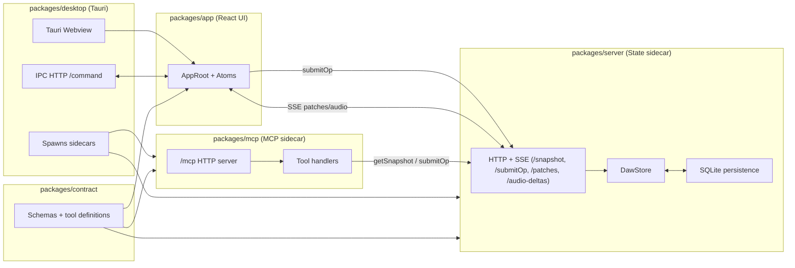
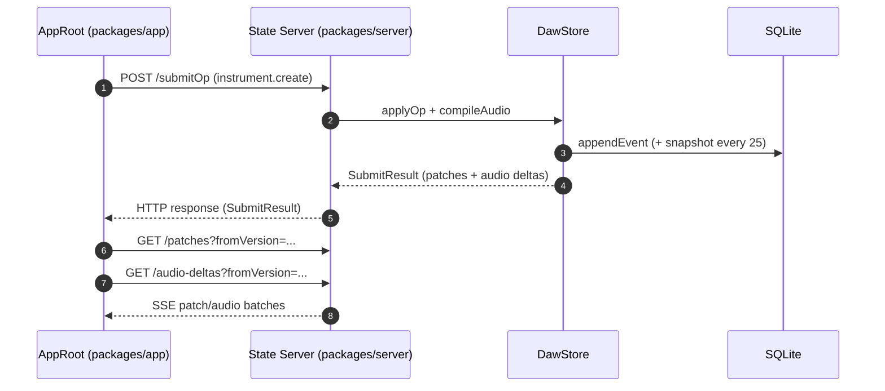
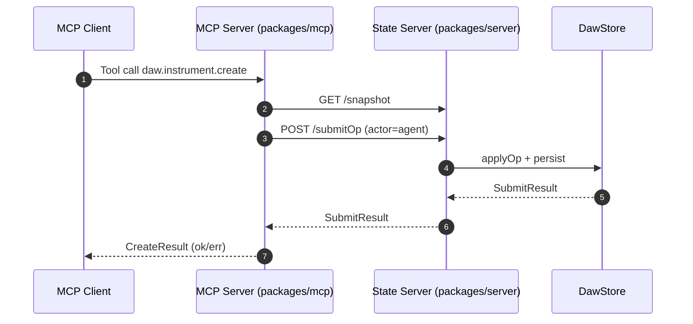
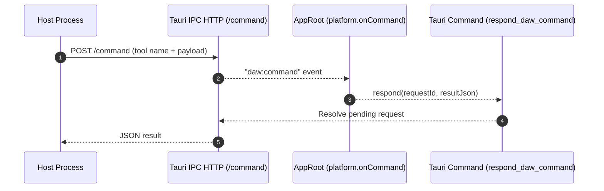

## Repo Architecture

This repo is a multi-package workspace for a DAW prototype built on React, Effect,
and Tauri. The core ideas:

- The **state server** owns project state and persists it to SQLite.
- The **app UI** renders state and submits ops over HTTP, then listens to SSE.
- The **desktop shell** runs the UI and spawns the state and MCP sidecars.
- The **MCP server** exposes tool calls that also mutate state through the same API.
- The **contract** package is the single source of truth for schemas and tool shapes.

## User Flow: Create Instrument (UI)

## Agent/Tool Flow: Create Instrument (MCP)

## Desktop IPC Flow: Tool Call Relay (Host -> UI)

