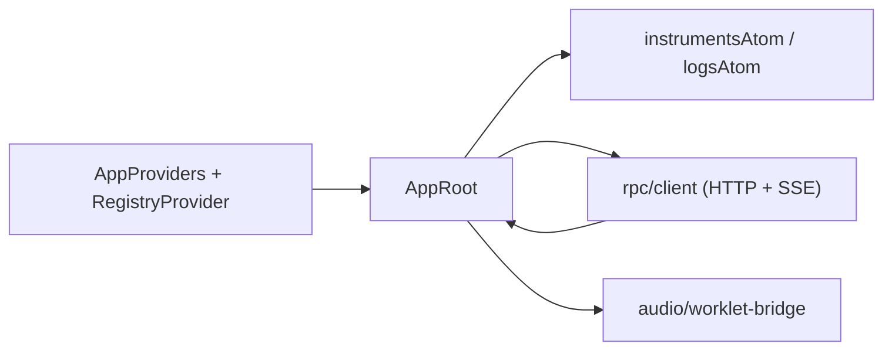
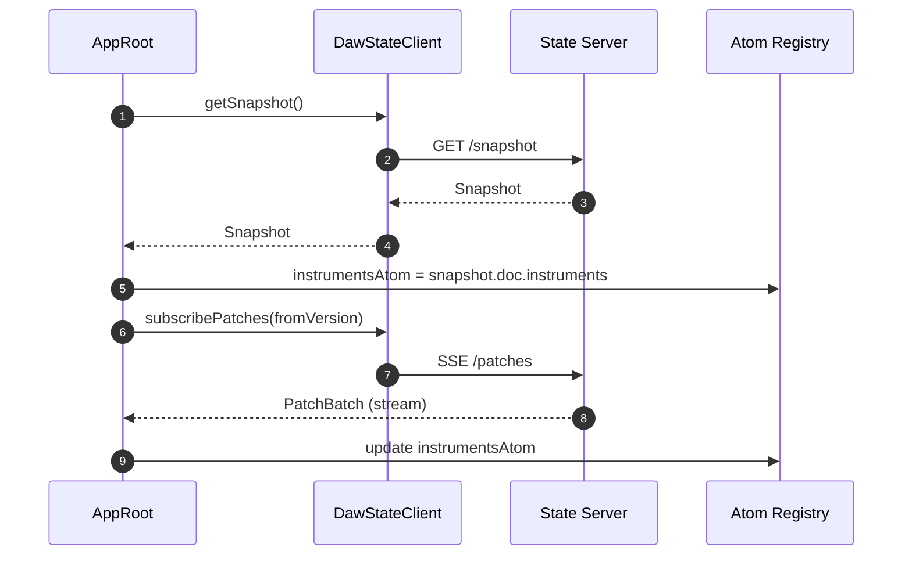
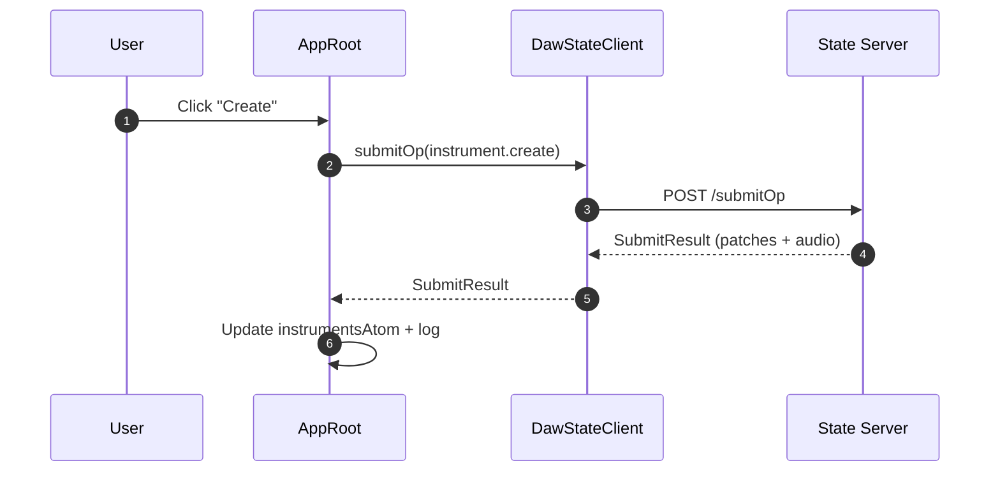

## packages/app Architecture

The app package is the React UI. It renders current DAW state, submits ops to the
state server, and streams patches/audio deltas over SSE. State in the UI is held
in Effect-Atom atoms.

## UI State Flow

## User Flow: Create Instrument

