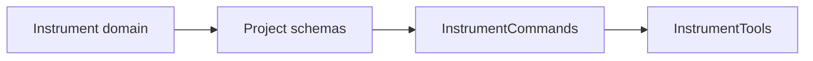
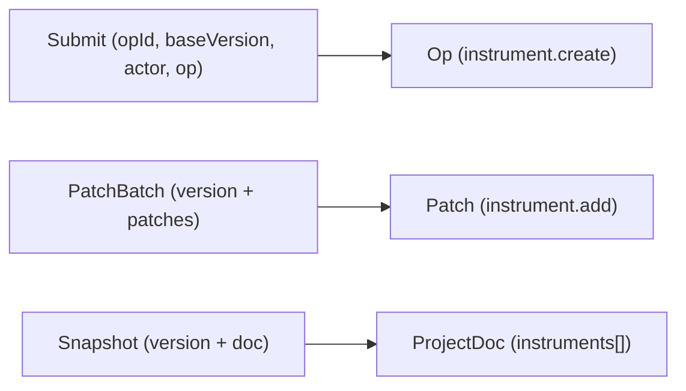
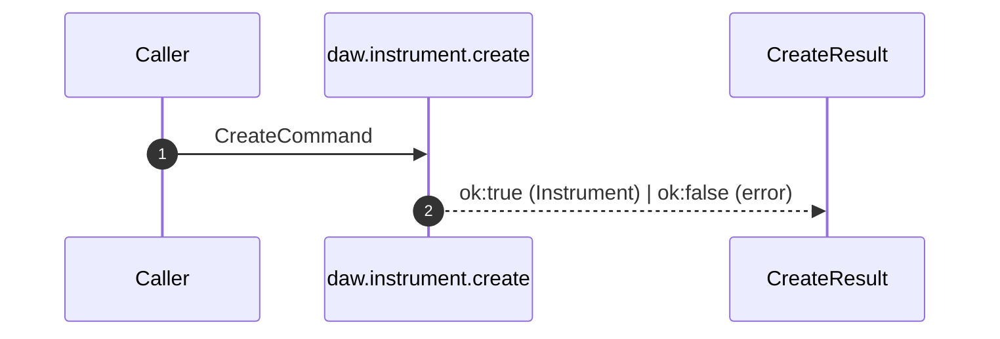

## packages/contract Architecture

The contract package defines the shared schema and tool interfaces used across
the UI, server, and MCP sidecar. It is the single source of truth for
serialization and validation.

## Project State Shape

## Tool Contract Flow

