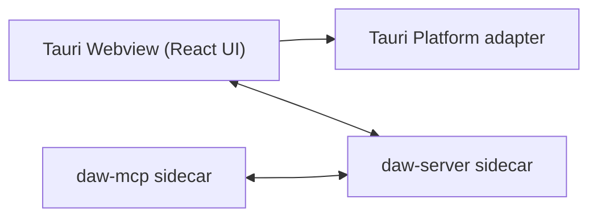
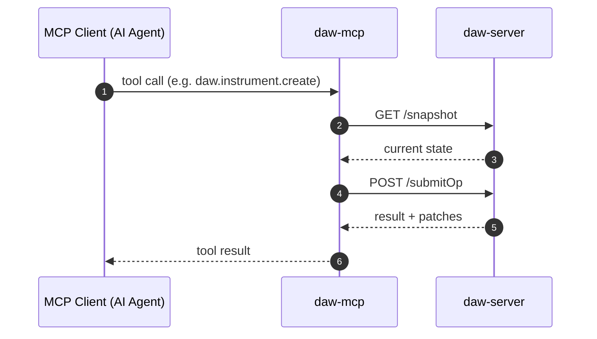
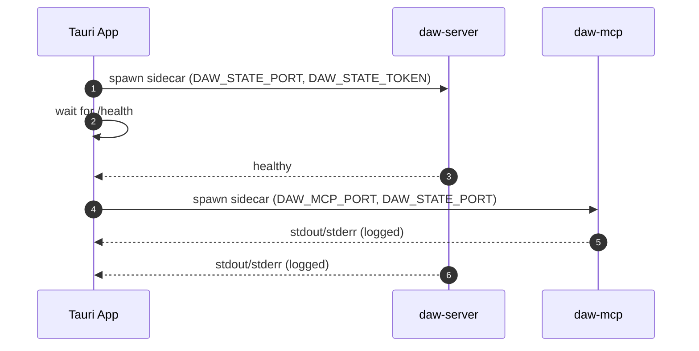

## packages/desktop Architecture

The desktop package is the Tauri shell. It renders the shared UI and spawns the
state + MCP sidecars. The MCP sidecar communicates directly with the state server
for all DAW operations.

## MCP → State Communication

The MCP sidecar communicates directly with the state server via HTTP:

## Sidecar Lifecycle

## Port Allocation

On startup, the Tauri app:

1. Checks if default ports are available (MCP=43124, STATE=43125)
2. If a port is in use, finds the next available port in a 100-port range
3. Passes allocated ports to sidecars via environment variables
4. Logs the final port assignments

## Graceful Shutdown

When the window closes or app exits:

1. Shutdown flag is set to stop sidecar output monitoring
2. All tracked sidecar child processes are explicitly killed
3. This prevents orphan processes from blocking ports on restart
