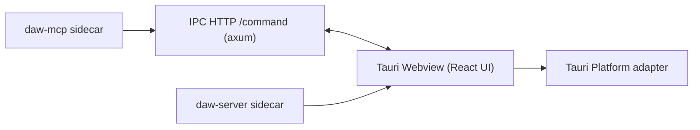
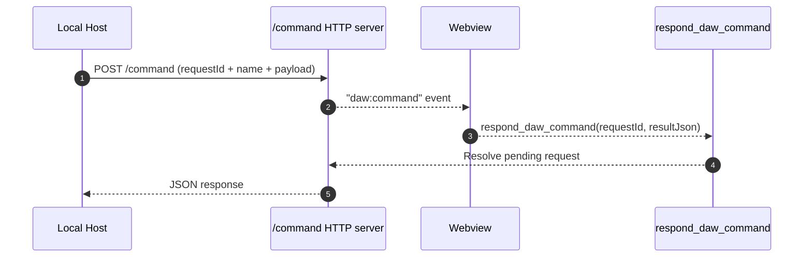
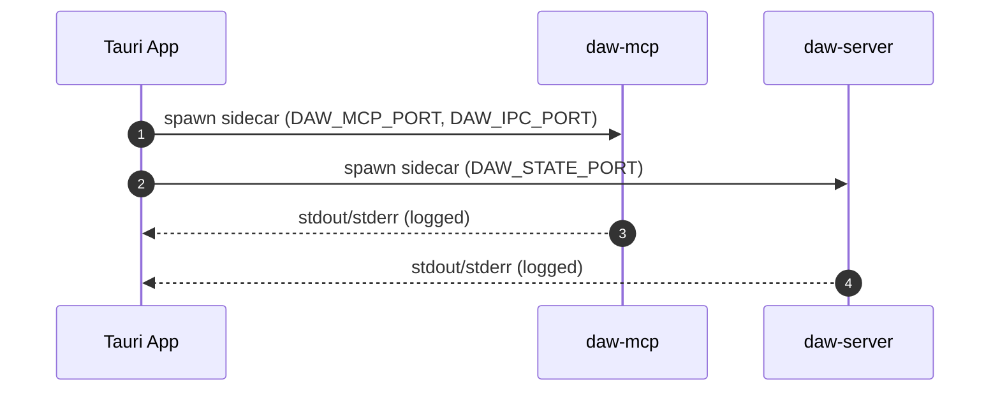

## packages/desktop Architecture

The desktop package is the Tauri shell. It renders the shared UI, spawns the
state + MCP sidecars, and exposes a local IPC HTTP bridge that forwards tool
calls into the UI and returns results.

## IPC Command Flow

## Sidecar Lifecycle

