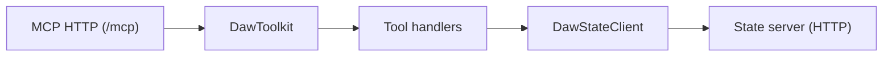
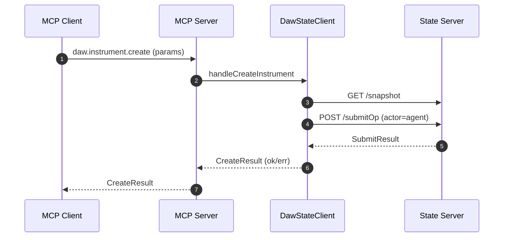

## packages/mcp Architecture

The MCP package exposes a Streamable HTTP MCP server. Tool handlers use an
Effect-native HTTP client to call the state server for snapshot and submit ops.

## Tool Call Flow: Create Instrument

