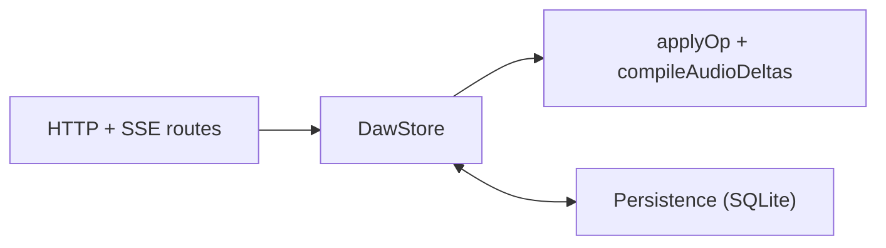
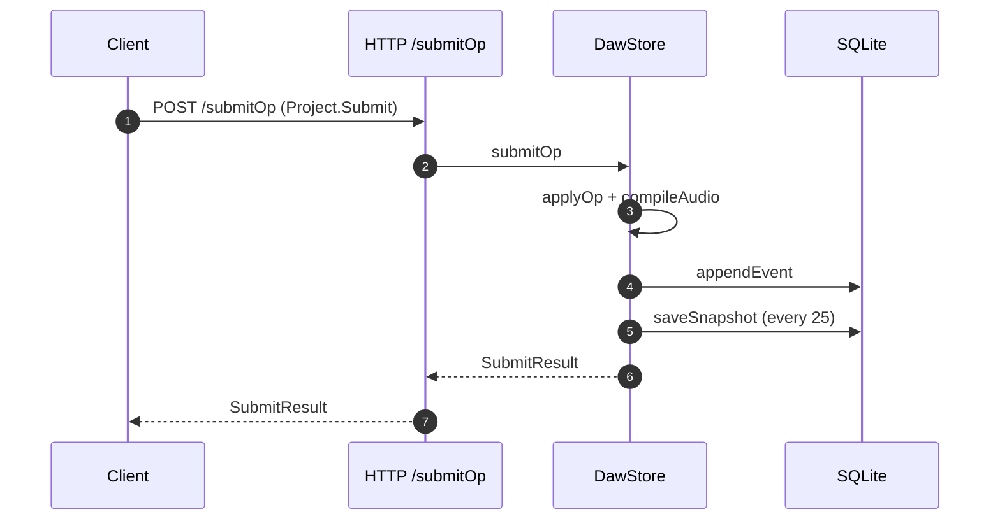
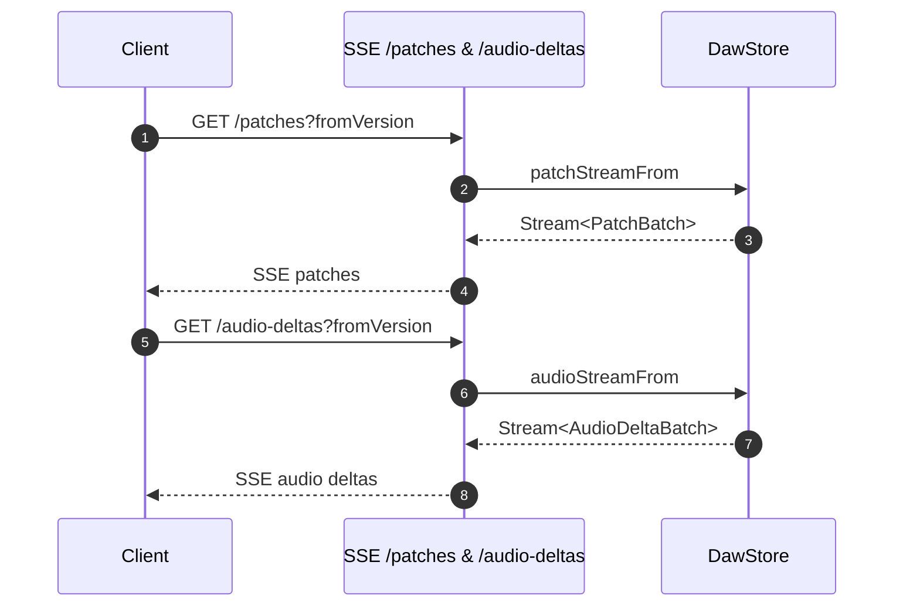

## packages/server Architecture

The server package is the state sidecar. It serves HTTP endpoints for snapshot,
submit operations, and SSE streams for patches + audio deltas. State lives in
`DawStore` and is persisted to SQLite via the persistence layer.

## Submit Flow

## Streaming Flow

